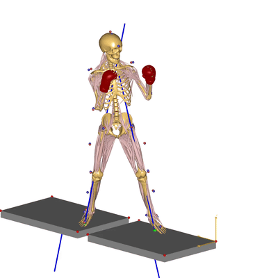

# Boxing example

This example shows the AnyMoCap framework applied to a set of boxing trial.
. Those values are then applied to the dynamic (jab-cross) 
trial.



This example uses a few special features from the AnyMoCap model:

* Model scaling and marker optimization is done based on a [standing reference
  T-posture](Subjects/s1/s1_jab-cross_1/TrialSpecificData.any#L6)
* [Etra drivers are added](ExtraDrivers.any) because there are not a enough markers to specify all degrees 
  of freedom in the arms.
* A [sepearate higher cut-off frequency is applied to the arm markers](MarkerProtocol.any#L555) to
  acommedate the fast motion of the jab.
* The file structured is organized with [all C3D file in a separate folder](LabSpecificData.any#L5). 
* Each trials has its own main file, which includes same base model but
  different `TrialsSpecificData.any` and `SubjectSpecificData.any` files.
* Medial/lateral shoulder marker are contrained to remain symmetrical in the parameter optimization.

The data for the example is provided by Sirichet Punthipayanon from the Sports Science Department at
Srinakharinwirot University in Tailand.

## Structure
The files are structured so each trials has its own folder with a main file
(`Main.any`), a file with trial specific data (`TrialSpecificData.any`). The C3D
files are placed in a separate folder.)

```
│   AnyMoCap.libdef.any
│   BodyModelConfig.any
│   C3DSettings.any
│   ExtraDrivers.any
│   ForcePlates.any
│   LabSpecificData.any
│   MarkerProtocol.any
│   ReadMe.md
│
├───c3d_files
│       s1_jab-cross_1.c3d
│       s1_t-pose_1.c3d
│
├───Output
│
└───Subjects
    └───s1
        │   SubjectSpecificData.any
        │
        ├───s1_jab-cross_1
        │       Main.any
        │       TrialSpecificData.any
        └───s1_t-pose_1
                Main.any
                TrialSpecificData.any

```


